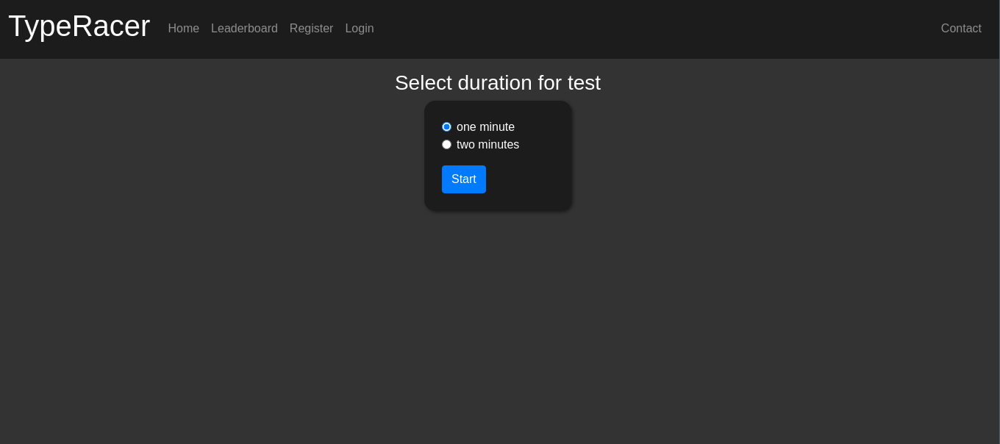
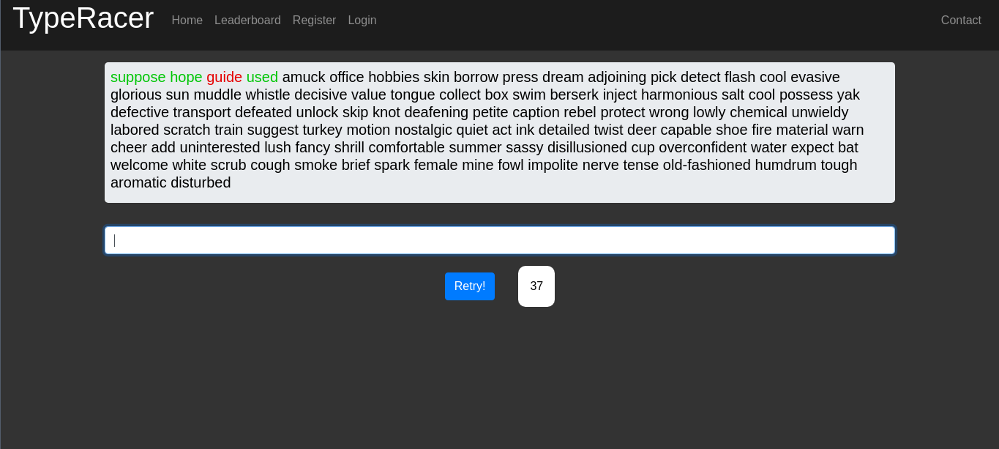
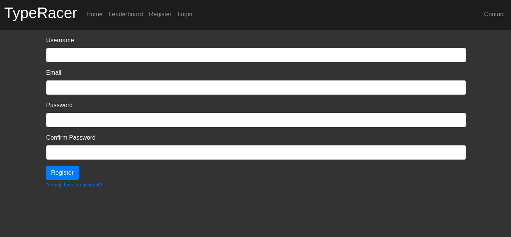

# TypeRacer

You can try the live hosted app here:

> A website to improve your typing made with flask

---

### Table of Contents

- [Description](#description)
- [Technologies](#technologies)
- [How To Use](#how-to-use)
- [Installation](#installation)
- [Images](#images)
- [License](#license)

---

## Description

A simple website to train on your typing muscles and compete with others on the leaderboards. A computer is recommended for this website

## Technologies

- Flask
- PostgreSQL
- Bootstrap
- JavaScript
- HTML/CSS

---

## How To Use

You can navigate to the link to view the hosted website here:

## Installation
Clone the app into your local machine with `git clone`.
`cd` into the cloned folder.
Install all the required packages with `python3 -r requirements.txt`.
Next rename the `env` file to `.env` and add the details to the configs.
Upgrade to the latest migrations version with `flask db upgrade`.
Once the upgrades are done, start the app locally into your machine with `flask run`.
Open browser and navigate to `localhost:5000`.
Start typing!.

## License

MIT License
[Read here](./LICENSE)

## Images

[Back To The Top](#typeracer)
